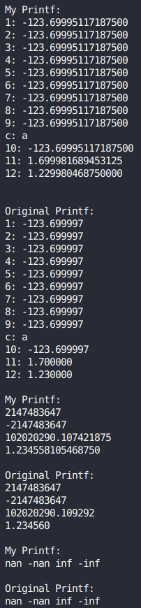

# Мой Printf

В задачу входила реализация своей версии стандартного printf с некоторыми его спецификаторами.

Для написания функции использовался ассемблер `NASM`, а для связи объектных файлов использовался линкер, вызываемый из `g++`.

В случае корректного завершения функция возвращает результат, равный `kDonePrintf`, определённого в [myprintf.h](myprintf.h).

## Манглирование

Во многих компиляторах, в `clang` и `g++`в том числе, используется манглирование для объявления разных одноимённых функций с разными параметрами и возвращаемыми значениями. Это реализовано с помощью добавления к имени функции дополнительной информации, содержащей тип возвращаемого значения, количество букв в имени функции, типы её параметров. В случае написания функции на ассемблере программист сам определяет имя метки функции, поэтому, чтобы к моей функции не применялось манглирование, я прописал перед её объявлением в файле [myprintf.h](myprintf.h) `extern "C"`, что даёт понять компилятору, что при вызове этой функции манглирование применять не надо, так как будет использоваться соглашение языка **Си**, в котором прописано, что имя метки функции совпадает с её именем в программе, написанной на **Си**.

## Реализованные спецификаторы

* `%c` - Вывод одного символа `char`
* `%s` - Вывод строки
* `%d` - Вывод числа типа `int` в десятичной системе счисления
* `%f` - Вывод чисел типов `float` и `double` в десятичной системе счисления с плавающей точкой
* `%b` - Вывод числа в двоичной системе счисления
* `%o` - Вывод числа в восьмеричной системе счисления
* `%x` - Вывод числа в шестнадцатеричной системе счисления
* `%n` - Запись по указателю количества выведенных символов к этому моменту

## Реализация спецификаторов

Для вывода используется буфер фиксированного размера (255 символов), который выводится при завершении функции или при его заполнении. Для индексации в буфере используется регистр **RCX**. При выводе используется `syscall`, после которого происходит проверка и возвращение кода ошибки в случае его некорректного завершения. Код ошибки определён в файле [myprintf.h](myprintf.h).

Для передачи всех аргументов в начале все регистры, используемые в соглашении **System V AMD64 ABI**, кладутся в стек, предварительно достав из него адрес возврата из функции. Затем в стек кладётся адрес возврата и значение регистра **RBP**, которому потом присваивается значение регистра **RSP**. В регистр **RSI** кладётся адрес форматной строки, а на первый после неё аргумент начинает указывать регистр **R8**, используемый для адресации к параметрам. В то же время, на начало аргументов, лежащих в стеке (по адресу `**RBP** - 8 * STACK_ELEMENT_SIZE`), начинает указывать регистр **R9**, используемый для адресации к параметрам функции, являющимся числами с плавающей точкой. Эти два указателя синхронизируются (принимают одинаковые значения) как только будут перебраны все параметры, переданные в функцию через регистры.

При анализе строки ищутся спецификаторы (сначала находится символ `%`, а затем определяется сам спецификатор), а затем при помощи **JUMP-таблицы** происходит выбор функции обработки спецификатора. В случае не валидного значения спецификатора функция возвращает код ошибки, который можно обработать с помощью переводчика ошибок из **enum** в строку.

### Обработка %c

Берётся символ и кладётся в буфер.

### Обработка %s

Выводится содержимое буфера, просматривается строка, переданная, как параметр. При просмотре определяется её длина, а затем эта строка выводится.

### Обработка %d

Сначала происходит проверка на минус в числе, затем число делится на 10 и по цифрам кладётся в стек. Затем при помощи "алфавита" цифр происходит посимвольный вывод числа.

### Обработка %f

Сначала происходит определение, какой способ получение параметра нужно использовать - взять его из широкого регистра **XMM** или из стека. Выбор происходит с помощью **JUMP-таблицы**, индексация в которой происходит с помощью локальной переменной, расположенной в стеке.

Затем происходит проверка на **NAN** и **INF** с помощью сравнения значения экспоненты с её максимальным значением и сравнения мантиссы с нулём.

С помощью битовых сдвигов в регистр **RBX** кладётся значение мантиссы + её старший бит, а в регистр **RDX** - значение экспоненты. Затем в регистр **RCX** кладётся значение, равное длине мантиссы минус количество нулей на её конце, а регистр **RBX** сдвигается вправо на число, количеству нулей на его конце. Затем к регистру **RCX** прибавляется значение экспоненты. Таким образом, мы получаем, что значение переданного числа равно $RBX * 2^{-RCX}$.

Далее происходит проверка:
- Если значение регистра **RCX** меньше нуля, тогда регистр **RBX** сдвигается влево на значение в **RCX** и выводится, как десятичное.
- В противном случае, можно представить полученное число, как $RBX * 2^{-RCX} = RBX * 10^{-RCX} * 5^{RCX}$. Далее посмотрим, как не допустить переполнения регистра при перемножении **RBX** на 5 в степени **RCX** с минимальным округлением значение. $RBX * 5^{RCX} = \frac{RBX}{2} * 10^{-(RCX - 1)} * 5^{RCX - 1}$ Таким образом мы можем битовым сдвигом на 1 вправо уменьшать **RBX**, уменьшая при этом и **RCX**, однако, сохраняя приближённое значение числа с плавающей точкой.
 Случай переполнения наступает, если  $RBX * 5^{RCX} > 2^{64}$. Однако, $RBX * 5^{RCX} < BX * 8^{RCX} = BX * 2^{3 * RCX}$. То есть, 5**RCX** можно сравнить с битовым сдвигом влево на величину 3 * **RCX**. Однако, это значение должно быть меньше, чем количество нулей в начале **RBX**. Тогда положим в регистр **RDX** количество нулей из начала регистра **RBX**, в регистр **RAX** сохраним значение **RCX**, а в регистр **RCX** положим его же значение, умноженное на 3. Сравним **RCX** и **RDX**. Если в **RDX** лежит большее значение, то умножаем **RBX** на 5**RCX** и выводим число в буфер, не забыв про точку, которая лежит левее последней значащей цифры числа на величину, равную **RCX**. Если же значение в **RDX** меньше, то вычтем его из **RCX** и поделим полученное значение на 4 при помощи битового сдвига (так как при каждом использовании приближения $RBX * 5^{RCX} = \frac{RBX}{2} * 10^{-(RCX - 1)} * 5^{RCX - 1}$ значение **RCX** уменьшается на единицу, а значение **RDX**, равное количеству не значащих нулей регистра **RBX**, увеличивается на единицу. Получается, что разница между **RDX** и 3 * **RCX** сокращается на 4 при каждом приближении). Теперь сдвинем **RBX** вправо на эту величину, уменьшим **RAX** на эту же величину и вернём значение из этого регистра в **RCX**. Теперь Умножаем **RBX** на 5**RCX** и выводим число в буфер, не забыв про точку, которая лежит левее последней значащей цифры числа на величину, равную **RCX**.

### Обработка %b, %o, %x

Сначала происходит проверка на минус в числе, а затем число битовыми сдвигами разбивается на отдельные цифры и при помощи "алфавита" цифр происходит посимвольный вывод числа.

### Обработка %n

Берётся аргумент и по его адресу кладётся значение, хранящееся в локальной переменной (расположенной в стеке) плюс значение регистра **RCX**.

## Сравнение со стандартным printf

Для сравнения я использовал вывод нескольких чисел с плавающей точкой (большей, чем количество используемых для их передачи регистров), а так же вывод посреди них параметра, не являющегося числом с плавающей точкой. Так же в сравнении я использовал вывод **INF** и **NAN** со знаком. Можно увидеть, что моя реализация вывода числа с плавающей точкой не такая точная, как стандартная, но всё же выводит примерно ожидаемый результат.
