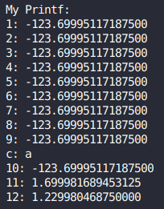
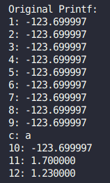
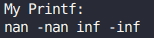
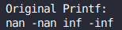
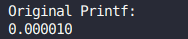

# Мой Printf

В задачу входила реализация своей версии стандартного printf с некоторыми его спецификаторами.

Для написания функции использовался ассемблер `NASM`, а для связи объектных файлов использовался линкер, вызываемый из `g++`.

## Пример использования

### Сборка программы

Нужно создать объектный файл с помощью `nasm`

Пример для x86-64 Linux:
```
nasm -f elf64 printf.asm -o printf.o
```

Затем слинковать его со всей программой с помощью `g++`.

Так же, файл с программой нужно добавить:
``` C
#include <myprintf.h>
```

### Вызов функции

В аргументы функции первым параметром передаётся форматная строка со спецификаторами, а в последующие - передаются аргументы в порядке упоминания спецификаторов, для обработки которых они используются.

``` C
enum MyPrintfError MyPrintf (const char* const format, ...);
```

В случае корректного завершения функция возвращает результат, равный `kDonePrintf`, определённого в [myprintf.h](myprintf.h).

<!-- ## Манглирование

Во многих компиляторах, в `clang` и `g++`в том числе, используется манглирование для объявления разных одноимённых функций с разными параметрами и возвращаемыми значениями. Это реализовано с помощью добавления к имени функции дополнительной информации, содержащей тип возвращаемого значения, количество букв в имени функции, типы её параметров. В случае написания функции на ассемблере программист сам определяет имя метки функции, поэтому, чтобы к моей функции не применялось манглирование, в файле [myprintf.h](myprintf.h) я прописал перед её объявлением `extern "C"`, что даёт понять компилятору, что при вызове этой функции манглирование применять не надо, так как будет использоваться соглашение языка **Си**, в котором прописано, что имя метки функции совпадает с её именем в программе, написанной на **Си**. -->

## Реализованные спецификаторы

| Спецификатор | Описание            |
| :---:        | :---:               |
| `%%`         | Вывод одного символа `%`
| `%c`         | Вывод одного символа `char`
| `%s`         | Вывод строки
| `%d`         | Вывод числа типа `int` в десятичной системе счисления
| `%f`         | Вывод чисел типов `float` и `double` в десятичной системе счисления с плавающей точкой
| `%b`         | Вывод числа в двоичной системе счисления
| `%o`         | Вывод числа в восьмеричной системе счисления
| `%x`         | Вывод числа в шестнадцатеричной системе счисления
| `%n`         | Запись по указателю количества выведенных символов к этому моменту

## Реализация спецификаторов

Для вывода используется буфер фиксированного размера (255 символов), который выводится при завершении функции или при его заполнении. Для индексации в буфере используется регистр **RCX**. При выводе используется `syscall`, после которого происходит проверка и возвращение кода ошибки в случае его некорректного завершения. Код ошибки определён в файле [myprintf.h](myprintf.h).

Для передачи всех аргументов в начале все регистры, используемые в соглашении **System V AMD64 ABI**, кладутся в стек, предварительно достав из него адрес возврата из функции. Затем в стек кладётся адрес возврата и значение регистра **RBP**, которому потом присваивается значение регистра **RSP**. В регистр **RSI** кладётся адрес форматной строки, а на первый после неё аргумент начинает указывать регистр **R8**, используемый для адресации к параметрам. В то же время, на начало аргументов, лежащих в стеке (по адресу `RBP - 8 * STACK_ELEMENT_SIZE`), начинает указывать регистр **R9**, используемый для адресации к параметрам функции, являющимся числами с плавающей точкой. Эти два указателя синхронизируются (принимают одинаковые значения) как только будут перебраны все параметры, переданные в функцию через регистры.

При анализе строки ищутся спецификаторы (сначала находится символ `%`, а затем определяется сам спецификатор), а затем при помощи **JUMP-таблицы** происходит выбор функции обработки спецификатора. В случае не валидного значения спецификатора функция возвращает код ошибки, который можно обработать с помощью переводчика ошибок из **enum** в строку.

### Обработка %c

Берётся символ и кладётся в буфер.

### Обработка %s

Выводится содержимое буфера, просматривается строка, переданная, как параметр. При просмотре определяется её длина, а затем эта строка выводится.

### Обработка %d

Сначала происходит проверка на минус в числе, затем число делится на 10 и по цифрам кладётся в стек. Затем при помощи "алфавита" цифр происходит посимвольный вывод числа.

### Обработка %f

Сначала происходит определение, какой способ получение параметра нужно использовать - взять его из широкого регистра **XMM** или из стека. Выбор происходит с помощью **JUMP-таблицы**, индексация в которой происходит с помощью локальной переменной, расположенной в стеке.

Затем происходит проверка на **NAN** и **INF** с помощью сравнения значения экспоненты с её максимальным значением и сравнения мантиссы с нулём.

Последующий алгоритм описан в виде псевдокода:

``` pseudocode
    RAX = число

    RBX = мантисса (RAX)
    RBX += 2 ^ (длина мантиссы)
    RDX = экспонента (RAX)

    RCX = количество нулей на конце RBX
    shr RBX, RCX

    RCX = (длина мантиссы) - RCX + RDX

    // Число = RBX * 2^(-RCX)

    Если (RCX < 0)
    {
        shl RBX, RCX
        PrintInt (RBX) // Вывод значения RBX как десятичного целого
    }
    Иначе
    {
        // Число = RBX * 2^(-RCX) = RBX * 5^(RCX) * 10^(-RCX)
        // Нужно не допустить переполнения регистра RBX при
        // перемножении его на 5^(RCX)

        // Для этого получившееся значение не должно быть
        // больше 2^64
        // Тогда вспомним, что
        // RBX * 5^(RCX) < RBX * 8^(RCX) = RBX * 2^(3*RCX)
        // То есть, чтобы не было переполнения, значение 3*RCX
        // Должно быть меньше количества незначащих нулей
        // в двоичной записи числа RBX

        RDX = количество незначащих нулей RBX

        Если (3 * RCX <= RDX)
        {
            RBX = RBX * 5^(RCX)
            PrintFloat (RBX, RCX)
            // Вывод числа, лежащего в RBX с учётом степени десятки, лежащей в RCX
            // (эта степень используется только постановки'.')
        }
        Иначе
        {
            // Для приближения воспользуемся выражением
            // RBX * 10^(-RCX) * 5^(RCX) = RBX/2 * 10^(-(RCX - 1)) * 5^(RCX - 1)
            // Тогда количество, сколько раз такое приближение будет
            // использовано, равно разнице (3*RCX - RDX), делённой
            // на 4, так как при каждом использовании приближения
            // RCX уменьшается на 1, а RDX, равное количеству
            // незначащих нулей RBX, увеличивается на 1, а в разницу
            // Эти регистры входят суммарно 4 раза

            RAX = RCX         // Сохраним первоначальное значение RCX
            RCX = RCX - RDX
            shr RCX, 4

            // Воспользуемся приближением
            shr RBX, RCX
            RAX = RAX - RCX
            RCX = RAX

            // Можно умножать RBX на 5^(RCX) и выводить
            RBX = RBX * 5^(RCX)
            PrintFloat (RBX, RCX)
            // Вывод числа, лежащего в RBX с учётом степени десятки, лежащей в RCX
            // (эта степень используется только постановки'.')
        }
    }

```


<!-- С помощью битовых сдвигов в регистр **RBX** кладётся значение мантиссы + её старший бит, а в регистр **RDX** - значение экспоненты. Затем в регистр **RCX** кладётся значение, равное длине мантиссы минус количество нулей на её конце, а регистр **RBX** сдвигается вправо на число, количеству нулей на его конце. Затем к регистру **RCX** прибавляется значение экспоненты. Таким образом, мы получаем, что значение переданного числа равно $RBX * 2^{-RCX}$.

Далее происходит проверка:
- Если значение регистра **RCX** меньше нуля, тогда регистр **RBX** сдвигается влево на значение в **RCX** и выводится, как десятичное.
- В противном случае, можно представить полученное число, как $RBX * 2^{-RCX} = RBX * 10^{-RCX} * 5^{RCX}$. Далее посмотрим, как не допустить переполнения регистра при перемножении **RBX** на 5 в степени **RCX** с минимальным округлением значение. $RBX * 10^{-RCX} * 5^{RCX} = \frac{RBX}{2} * 10^{-(RCX - 1)} * 5^{RCX - 1}$ Таким образом мы можем битовым сдвигом на 1 вправо уменьшать **RBX**, уменьшая при этом и **RCX**, однако, сохраняя приближённое значение числа с плавающей точкой.
 Случай переполнения наступает, если  $RBX * 5^{RCX} > 2^{64}$. Однако, $RBX * 5^{RCX} < BX * 8^{RCX} = BX * 2^{3 * RCX}$. То есть, 5<sup>**RCX**</sup> можно сравнить с битовым сдвигом влево на величину 3 * **RCX**. Однако, это значение должно быть меньше, чем количество нулей в начале **RBX**. Тогда положим в регистр **RDX** количество нулей из начала регистра **RBX**, в регистр **RAX** сохраним значение **RCX**, а в регистр **RCX** положим его же значение, умноженное на 3. Сравним **RCX** и **RDX**. Если в **RDX** лежит большее значение, то умножаем **RBX** на 5<sup>**RCX**</sup> и выводим число в буфер, не забыв про точку, которая лежит левее последней значащей цифры числа на величину, равную **RCX**. Если же значение в **RDX** меньше, то вычтем его из **RCX** и поделим полученное значение на 4 при помощи битового сдвига (так как при каждом использовании приближения $RBX * 5^{RCX} = \frac{RBX}{2} * 10^{-(RCX - 1)} * 5^{RCX - 1}$ значение **RCX** уменьшается на единицу, а значение **RDX**, равное количеству не значащих нулей регистра **RBX**, увеличивается на единицу. Получается, что разница между **RDX** и 3 * **RCX** сокращается на 4 при каждом приближении). Теперь сдвинем **RBX** вправо на эту величину, уменьшим **RAX** на эту же величину и вернём значение из этого регистра в **RCX**. Теперь Умножаем **RBX** на 5<sup>**RCX**</sup> и выводим число в буфер, не забыв про точку, которая лежит левее последней значащей цифры числа на величину, равную **RCX**. -->

### Обработка %b, %o, %x

Сначала происходит проверка на минус в числе, а затем число битовыми сдвигами разбивается на отдельные цифры и при помощи "алфавита" цифр происходит посимвольный вывод числа.

### Обработка %n

Берётся аргумент и по его адресу кладётся значение, хранящееся в локальной переменной (расположенной в стеке) плюс значение регистра **RCX**.

## Сравнение со стандартным printf

| Описание использования | MyPrintf                         | Стандартный printf |
| :---:                  | :---:                            | :---:              |
| Передача в функцию множества аргументов с плавающей точкой и вставка посреди них символа |  | 
| Передача в функцию `NAN` и `INF` |  | 
| Передача в функцию маленького числа с плавающей точкой (в данном случае $10^{-5}$) |  | 

Для сравнения я использовал вывод нескольких чисел с плавающей точкой (большей, чем количество используемых для их передачи регистров), а так же вывод посреди них параметра, не являющегося числом с плавающей точкой. Так же в сравнении я использовал вывод **INF** и **NAN** со знаком, а ещё маленьких чисел. Можно увидеть, что моя реализация вывода числа с плавающей точкой не такая точная, как стандартная, но всё же выводит примерно ожидаемый результат.

## Возвращаемые значения

| Возвращаемое значение     | Числовой эквивалент | Определение |
| :---:                     | :---:               | :---:       |
| `kDonePrintf`             | 0                   | Корректное завершение функции   |
| `kInvalidSpecifierPrintf` | 1                   | В форматной строке был использован неизвестный спецификатор   |
| `kSyscallErrorPrintf`     | 2                   | При вызове `syscall` для вывода буфера произошла ошибка   |
